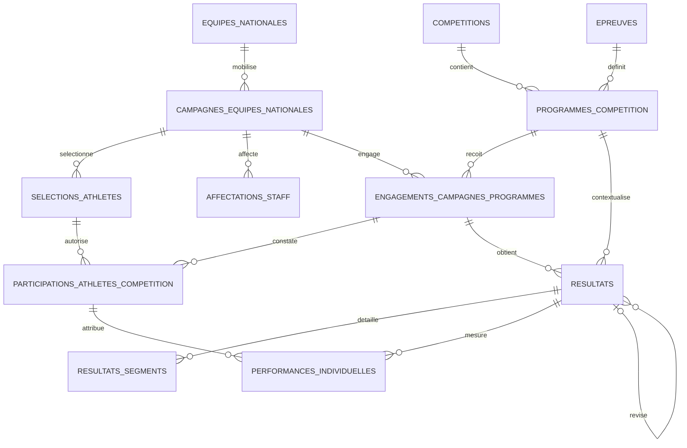

# Bloc COMPÉTITIONS — T03 — Modèle relationnel V1 définitif

Date : 1er septembre 2026  
Statut : terminé, en attente de validation humaine  
Nature : documentation et décisions uniquement; aucune écriture Google Sheets

## 1. Décisions intégrées

- `COMPETITIONS` représente une édition concrète; `EDITIONS_COMPETITION` est hors V1.
- Une compétition multisport est unique et possède plusieurs programmes.
- Une campagne, jamais l’équipe permanente, s’engage dans un programme.
- Engagement, sélection et participation effective sont trois faits distincts.
- Un résultat appartient simultanément au programme et à l’engagement concerné.
- Les résultats ne sont pas copiés dans les équipes nationales.
- Les corrections de résultat sont versionnées et reliées; aucune valeur homologuée n’est écrasée silencieusement.
- Aucun classement n’est calculé sans règle officielle. Une éventuelle feuille de classements est différée hors V1.

Ces décisions sont inscrites dans `CONTEXT.md` et dans l’ADR `0003-modele-v1-competitions-et-engagements-de-campagnes.md`.

## 2. Modèle relationnel

### Cardinalités et invariants

1. Une compétition contient zéro à plusieurs programmes; un programme appartient à une seule compétition.
2. Une équipe nationale contient zéro à plusieurs campagnes; une campagne appartient à une seule équipe.
3. Une campagne peut avoir plusieurs engagements et un programme plusieurs campagnes engagées.
4. Le couple `(id_programme_competition, id_campagne)` est unique parmi les engagements non annulés dont les périodes se chevauchent.
5. Une sélection appartient à une campagne et à un athlète. Elle ne crée aucune participation.
6. Une participation effective relie exactement une sélection et un engagement. La campagne de la sélection doit être celle de l’engagement.
7. Un résultat relie exactement un programme et un engagement. Le programme du résultat doit être celui de l’engagement.
8. Un segment appartient à une version de résultat; `(id_resultat, id_type_segment, numero_segment)` est unique.
9. Une performance appartient à une version de résultat et à une participation effective compatible avec son engagement.
10. Une nouvelle version de résultat conserve `id_resultat_logique`, incrémente `numero_version` et référence la version précédente; une seule version est courante.

## 3. Noms définitifs des feuilles V1

### Classeur `07_COMPETITIONS`

1. `COMPETITIONS` — conservée.
2. `PROGRAMMES_COMPETITION` — conservée.
3. `ENGAGEMENTS_CAMPAGNES_PROGRAMMES` — remplace `COMPETITIONS_EQUIPES_NATIONALES`.
4. `PARTICIPATIONS_ATHLETES_COMPETITION` — conservée.
5. `RESULTATS` — conservée et enrichie pour provenance, validation et version.
6. `RESULTATS_SEGMENTS` — conservée.
7. `PERFORMANCES_INDIVIDUELLES` — conservée.

### Classeur `08_EQUIPES_NATIONALES`

1. `EQUIPES_NATIONALES` — conservée.
2. `CAMPAGNES_EQUIPES_NATIONALES` — conservée.
3. `SELECTIONS_ATHLETES` — conservée.
4. `AFFECTATIONS_STAFF` — conservée.

### Classeur `00_REFERENTIELS`

Les feuilles existantes sont conservées, sauf `STATUTS_PARTICIPATION_COMPETITION`, renommée `STATUTS_PARTICIPATION_ATHLETE`. Quatre feuilles sont ajoutées : `STATUTS_SELECTION`, `STATUTS_ENGAGEMENT_PROGRAMME`, `STATUTS_VALIDATION_RESULTAT` et `DISTINCTIONS_SPORTIVES`.

## 4. Dictionnaire définitif des feuilles métier

Convention : toutes les dates sont ISO `YYYY-MM-DD`; les booléens sont `OUI` ou `NON`; chaque libellé référentiel est résolu par ID et n’est jamais recopié.

### `COMPETITIONS`

| Champ | Obligation | Règle |
| --- | --- | --- |
| `id_competition` | oui, clé | immuable; préfixe `COMP` |
| `nom_competition` | oui | nom de l’édition concrète |
| `id_type_competition` | oui | FK `TYPES_COMPETITION` |
| `id_niveau_competition` | oui | FK `NIVEAUX_COMPETITION` |
| `edition` | non | libellé officiel, année ou numéro; ne crée pas un objet séparé |
| `est_multisport` | oui | `OUI` ou `NON` |
| `date_debut` | oui | antérieure ou égale à la fin |
| `date_fin` | non | vide tant qu’inconnue |
| `pays`, `ville`, `lieu` | non | localisation de l’édition |
| `id_statut_competition` | oui | FK `STATUTS_COMPETITION` |
| `observation` | non | texte libre |

Unicité métier indicative : nom normalisé + édition + date de début + pays. Elle signale un doublon mais ne remplace pas la clé.

### `PROGRAMMES_COMPETITION`

| Champ | Obligation | Règle |
| --- | --- | --- |
| `id_programme_competition` | oui, clé | préfixe `PRG` |
| `id_competition` | oui | FK `COMPETITIONS` |
| `id_epreuve` | oui | FK `EPREUVES`; résout fédération, sport, discipline, format et type de résultat |
| `id_categorie_age` | non | FK `CATEGORIES_AGE` compatible avec l’épreuve |
| `id_sexe` | non | FK `SEXES`; obligatoire si l’épreuve est sexuée |
| `date_debut`, `date_fin` | non | incluses dans la période de compétition lorsqu’elle est connue |
| `observation` | non | texte libre |

Unicité : compétition + épreuve + catégorie d’âge + sexe.

### `ENGAGEMENTS_CAMPAGNES_PROGRAMMES`

| Champ | Obligation | Règle |
| --- | --- | --- |
| `id_engagement_campagne` | oui, clé | préfixe `ENG` |
| `id_programme_competition` | oui | FK `PROGRAMMES_COMPETITION` |
| `id_campagne` | oui | FK `CAMPAGNES_EQUIPES_NATIONALES` |
| `id_statut_engagement` | oui | FK `STATUTS_ENGAGEMENT_PROGRAMME` |
| `date_engagement` | oui | date de l’acte d’engagement |
| `date_debut`, `date_fin` | non | validité opérationnelle de l’engagement |
| `id_federation_source` | oui | fédération ayant transmis l’engagement; doit correspondre à celle de l’équipe sauf anomalie justifiée |
| `date_transmission` | oui | date de réception par le COC |
| `reference_source` | non | référence du bordereau, document ou système source |
| `observation` | non | justification d’écart ou commentaire |

La fédération responsable reste résolue via campagne → équipe. `id_federation_source` ne duplique pas ce rattachement : il qualifie la provenance de la déclaration.

### `PARTICIPATIONS_ATHLETES_COMPETITION`

| Champ | Obligation | Règle |
| --- | --- | --- |
| `id_participation_athlete` | oui, clé | préfixe `PAT` |
| `id_engagement_campagne` | oui | FK engagement |
| `id_selection` | oui | FK `SELECTIONS_ATHLETES` |
| `id_statut_participation` | oui | FK `STATUTS_PARTICIPATION_ATHLETE` |
| `date_statut` | oui | date du constat courant |
| `id_selection_remplacement` | non | sélection remplaçante lorsque le statut est `REMPLACE` |
| `observation` | non | motif ou précision |

Unicité : engagement + sélection. `PARTICIPANT` est le seul statut prouvant une présence effective; `INSCRIT` ne la prouve pas.

### `RESULTATS`

| Champ | Obligation | Règle |
| --- | --- | --- |
| `id_resultat` | oui, clé | identifiant de version; préfixe `RES` |
| `id_resultat_logique` | oui | stable entre les versions; préfixe `RSL` |
| `numero_version` | oui | entier ≥ 1 |
| `id_resultat_precedent` | non | FK vers la version remplacée |
| `est_version_courante` | oui | une seule version `OUI` par résultat logique |
| `id_engagement_campagne` | oui | FK engagement |
| `id_programme_competition` | oui | doit égaler le programme de l’engagement |
| `date_resultat` | oui | date officielle |
| `phase` | non | libellé officiel de phase/tour |
| `adversaire`, `pays_adversaire` | non | requis seulement pour une confrontation |
| `id_resultat_synthetique` | non | FK `RESULTATS_SYNTHETIQUES` |
| `valeur_rdc`, `valeur_adversaire` | non | score ou mesure commune |
| `id_unite_mesure` | non | FK `UNITES_MESURE` si les valeurs sont mesurées |
| `id_decision_resultat` | non | FK `DECISIONS_RESULTATS` |
| `id_federation_source` | oui | producteur de la donnée transmise |
| `date_transmission` | oui | date de réception |
| `reference_source` | non | référence officielle |
| `id_statut_validation_resultat` | oui | FK `STATUTS_VALIDATION_RESULTAT` |
| `date_validation` | non | requise à partir de `VALIDE_FEDERATION` |
| `id_validateur_coc` | non | ID utilisateur; requis pour validation COC/homologation enregistrée |
| `motif_correction` | non | requis à partir de la version 2 |
| `observation` | non | texte libre |

Un résultat sans score reste valide s’il porte une synthèse ou une décision officielle. La fiche Équipe nationale ne conserve aucun champ résultat; elle suit les relations.

### `RESULTATS_SEGMENTS`

Champs définitifs : `id_segment_resultat` (clé, `SEG`), `id_resultat` (FK vers une version), `id_type_segment`, `numero_segment`, `valeur_rdc`, `valeur_adversaire`, `observation`. Type et numéro sont obligatoires; les valeurs sont facultatives si le segment est non disputé et justifié.

### `PERFORMANCES_INDIVIDUELLES`

Champs définitifs : `id_performance` (clé, `PERF`), `id_resultat`, `id_participation_athlete`, `id_type_resultat`, `valeur`, `id_unite_mesure`, `rang`, `est_record`, `est_meilleure_performance`, `id_distinction`, `observation`. Résultat, participation et type sont obligatoires. Valeur ou rang ou distinction doit être renseigné. `id_distinction` est une FK facultative vers `DISTINCTIONS_SPORTIVES`.

### Feuilles Équipes nationales

- `EQUIPES_NATIONALES` : schéma réel conservé; `id_federation`, `id_sport`, nom, sexe, début et statut obligatoires; discipline/âge/fin/observation facultatifs.
- `CAMPAGNES_EQUIPES_NATIONALES` : schéma réel conservé; ID, équipe, nom, début et statut obligatoires.
- `SELECTIONS_ATHLETES` : conserve `id_athlete` comme nom physique, mappé vers `ATHLETES.id_athlete_coc`; ajoute aucune participation; `statut_selection` est renommé `id_statut_selection`.
- `AFFECTATIONS_STAFF` : schéma réel conservé; `id_type_acteur` doit être un ID de `TYPES_ACTEURS`, jamais le libellé `COACH`/`MEDECIN` codé en dur.

## 5. Référentiels à peupler

### Référentiels nationaux fermés

| Feuille | ID | Libellé / règle |
| --- | --- | --- |
| `TYPES_COMPETITION` | `TCOMP_JEUX_MULTISPORTS` | Jeux multisports |
|  | `TCOMP_CHAMPIONNAT` | Championnat |
|  | `TCOMP_COUPE` | Coupe |
|  | `TCOMP_TOURNOI` | Tournoi |
|  | `TCOMP_QUALIFICATION` | Qualification |
|  | `TCOMP_RENCONTRE_AMICALE` | Rencontre amicale |
| `NIVEAUX_COMPETITION` | `NIV_INTERNATIONAL` | International |
|  | `NIV_CONTINENTAL` | Continental |
|  | `NIV_REGIONAL` | Régional |
|  | `NIV_NATIONAL` | National |
| `STATUTS_COMPETITION` | `PLANIFIEE` | Planifiée |
|  | `EN_COURS` | En cours |
|  | `TERMINEE` | Terminée |
|  | `REPORTEE` | Reportée |
|  | `ANNULEE` | Annulée |
| `STATUTS_SELECTION` | `PRESELECTIONNE` | Présélectionné |
|  | `SELECTIONNE` | Sélectionné |
|  | `REMPLACANT` | Remplaçant |
|  | `NON_RETENU` | Non retenu |
|  | `RETIRE` | Retiré |
| `STATUTS_PARTICIPATION_ATHLETE` | `INSCRIT` | Inscrit, présence non prouvée |
|  | `PARTICIPANT` | Présence effective prouvée |
|  | `ABSENT` | Inscrit/sélectionné mais absent |
|  | `FORFAIT` | Forfait déclaré |
|  | `REMPLACE` | Remplacé par une autre sélection |
| `STATUTS_ENGAGEMENT_PROGRAMME` | `PREVU` | Engagement préparé |
|  | `SOUMIS` | Transmis par la fédération |
|  | `CONFIRME` | Accepté/confirmé |
|  | `RETIRE` | Retiré par la fédération |
|  | `ANNULE` | Annulé par l’organisation |
| `STATUTS_VALIDATION_RESULTAT` | `BROUILLON` | Non transmis |
|  | `TRANSMIS` | Reçu de la source |
|  | `VALIDE_FEDERATION` | Validé par la fédération responsable |
|  | `VALIDE_COC` | Contrôlé et consolidé par le COC |
|  | `HOMOLOGUE` | Homologué par l’autorité compétente |
|  | `CORRIGE` | Version remplacée par une correction |
|  | `ANNULE` | Résultat annulé officiellement |
| `FORMATS_PARTICIPATION` | `FMT_EQUIPE` | Équipe |
|  | `FMT_INDIVIDUEL` | Individuel |
|  | `FMT_PAIRE` | Paire/double |
|  | `FMT_RELAIS` | Relais |
| `UNITES_MESURE` | `UNIT_POINT` | Point |
|  | `UNIT_BUT` | But |
|  | `UNIT_SECONDE` | Seconde |
|  | `UNIT_METRE` | Mètre |
|  | `UNIT_CENTIMETRE` | Centimètre |
|  | `UNIT_KILOGRAMME` | Kilogramme |
|  | `UNIT_NOTE` | Note |
| `RESULTATS_SYNTHETIQUES` | `SYN_VICTOIRE` | Victoire |
|  | `SYN_NUL` | Nul |
|  | `SYN_DEFAITE` | Défaite |
|  | `SYN_QUALIFIE` | Qualifié |
|  | `SYN_ELIMINE` | Éliminé |
|  | `SYN_OR`, `SYN_ARGENT`, `SYN_BRONZE` | Médaille officielle |
| `TYPES_SEGMENTS_RESULTATS` | `SEG_QUART_TEMPS` | Quart-temps, maximum 4 |
|  | `SEG_MI_TEMPS` | Mi-temps, maximum 2 |
|  | `SEG_SET` | Set, maximum défini par discipline |
|  | `SEG_ROUND` | Round, maximum défini par discipline |
|  | `SEG_MANCHE` | Manche, maximum défini par discipline |
| `DECISIONS_RESULTATS` | `DEC_FORFAIT` | Forfait |
|  | `DEC_ABANDON` | Abandon |
|  | `DEC_DISQUALIFICATION` | Disqualification |
|  | `DEC_DECISION_ARBITRALE` | Décision arbitrale |
|  | `DEC_WALKOVER` | Walkover |

`TYPES_RESULTAT` contient exactement le noyau initial suivant :

| ID | Libellé | Unité par défaut | Sens de performance |
| --- | --- | --- | --- |
| `TR_SCORE` | Score | `UNIT_POINT` | supérieur |
| `TR_POINTS` | Points | `UNIT_POINT` | supérieur |
| `TR_TEMPS` | Temps | `UNIT_SECONDE` | inférieur |
| `TR_DISTANCE` | Distance | `UNIT_METRE` | supérieur |
| `TR_HAUTEUR` | Hauteur | `UNIT_METRE` | supérieur |
| `TR_POIDS` | Poids | `UNIT_KILOGRAMME` | supérieur |
| `TR_NOTE` | Note | `UNIT_NOTE` | supérieur |
| `TR_RANG` | Rang | aucune | inférieur |

Chaque ligne peut être spécialisée par fédération/sport/discipline lorsque la règle officielle varie.

### Référentiels gouvernés par les fédérations

`EPREUVES`, `POSTES_ATHLETES`, `CATEGORIES_POIDS`, `GRADES_SPORTIF`, `CATEGORIES_AGE` et `DISTINCTIONS_SPORTIVES` ne reçoivent pas une liste nationale inventée. Ils sont peuplés à partir de règlements officiels et rattachés à `id_federation`, `id_sport` et `id_discipline`. La nouvelle feuille `DISTINCTIONS_SPORTIVES` porte exactement `id_distinction`, `id_federation`, `id_sport`, `id_discipline`, `nom_distinction`, `description`, `statut`, `observations`. Pour les quatre tests papier, les seules épreuves minimales proposées sont :

- `EPR_BSK_5X5_H` : `FED003`, `BSK`, `DISC006`, Basket 5×5 masculin, `FMT_EQUIPE`, `TR_SCORE`;
- `EPR_VOL_INDOOR_H` : `FED013`, `VOL`, `DISC061`, Volleyball indoor masculin, `FMT_EQUIPE`, `TR_SCORE`;
- `EPR_ATH_100M_H` : `FED001`, `ATH`, `DISC001`, 100 mètres masculin, `FMT_INDIVIDUEL`, `TR_TEMPS`.

Ces trois lignes restent des propositions de migration : leurs libellés et règles doivent être confirmés contre les règlements fédéraux avant peuplement réel.

### Rôles de staff minimaux

`ROLES_STAFF_EQUIPE_NATIONALE` reçoit au minimum : `ROLE_ENTRAINEUR_PRINCIPAL` (`TYPACT002`), `ROLE_ENTRAINEUR_ADJOINT` (`TYPACT002`), `ROLE_MEDECIN` (`TYPACT003`), `ROLE_OFFICIEL` (`TYPACT005`), `ROLE_CHEF_DELEGATION` (`TYPACT006`) et `ROLE_TEAM_MANAGER` (`TYPACT006`).

## 6. Quatre scénarios papier

### A. Jeux Olympiques multisports

Une ligne `COMPETITIONS` porte les Jeux, `est_multisport=OUI`. Trois programmes référencent les épreuves Basket 5×5, Volleyball indoor et 100 m. Trois campagnes éventuellement issues de trois équipes nationales distinctes créent chacune leur engagement dans leur programme. Aucun sport ne crée une seconde compétition. Résultat : cardinalités valides et absence de duplication de l’événement.

### B. Match de Basket

La campagne Basket de `FED003` s’engage dans le programme `EPR_BSK_5X5_H`. Douze athlètes peuvent être `SELECTIONNE`; dix peuvent être `INSCRIT`; huit peuvent avoir le statut `PARTICIPANT`. Le résultat commun contient le score final et quatre lignes `SEG_QUART_TEMPS`. Les deux athlètes restés `INSCRIT` ne sont pas déduits participants. Résultat : sélection, inscription et présence restent distinctes.

### C. Match de Volleyball avec sets

La campagne Volleyball de `FED013` s’engage dans `EPR_VOL_INDOOR_H`. Le résultat contient la synthèse officielle et le score en sets; trois à cinq segments `SEG_SET` portent les points par set. La somme ou le vainqueur ne sont pas recalculés sans règle officielle versionnée : les données transmises restent la source. Résultat : détail sportif sans table Volleyball dédiée.

### D. Épreuve d’Athlétisme

La campagne Athlétisme de `FED001` s’engage dans `EPR_ATH_100M_H`. Un athlète sélectionné reçoit une participation `PARTICIPANT`. Le résultat porte le contexte de l’épreuve; `PERFORMANCES_INDIVIDUELLES` porte son temps en `UNIT_SECONDE`, son rang et, si officiel, le drapeau de record. Un athlète `ABSENT` ne peut recevoir aucune performance. Résultat : mesure individuelle rattachée à une présence effective.

Les quatre scénarios satisfont les invariants. Ils échouent volontairement si campagne/programme ne correspondent pas, si une participation est créée sans sélection, ou si une performance cible un non-participant.

## 7. Renommages et changements proposés

| Existant | Cible | Nature |
| --- | --- | --- |
| `COMPETITIONS_EQUIPES_NATIONALES` | `ENGAGEMENTS_CAMPAGNES_PROGRAMMES` | renommage d’onglet et remplacement complet des colonnes |
| `id_participation_equipe` | `id_engagement_campagne` | renommage de clé |
| `id_competition`, `id_equipe_nationale` dans l’engagement | `id_programme_competition`, `id_campagne` | remplacement des FK |
| `statut_participation` dans l’engagement | `id_statut_engagement` | sémantique clarifiée |
| `PARTICIPATIONS_ATHLETES_COMPETITION.id_participation_equipe` | `id_engagement_campagne` | FK renommée |
| `PARTICIPATIONS_ATHLETES_COMPETITION.date_participation` | `date_statut` | le champ date tous les états, pas seulement la présence |
| aucune colonne de statut participant | `id_statut_participation` | ajout |
| `SELECTIONS_ATHLETES.statut_selection` | `id_statut_selection` | FK explicite |
| `STATUTS_PARTICIPATION_COMPETITION` | `STATUTS_PARTICIPATION_ATHLETE` | renommage du référentiel |
| `RESULTATS.id_participation_equipe` | `id_engagement_campagne` | FK renommée |
| `RESULTATS` actuel | schéma versionné et sourcé de la section 4 | enrichissement |
| `PERFORMANCES_INDIVIDUELLES` | ajout facultatif `id_distinction` | FK vers le nouveau référentiel fédéral |

Toutes les colonnes `observations` des feuilles métier migrées sont harmonisées vers `observation` au singulier. Les adaptateurs d’interface peuvent conserver `observations` comme nom fonctionnel.

## 8. Plan précis de migration

### Préconditions

1. Validation humaine du présent T03.
2. Nouvelle lecture read-only confirmant que les feuilles à transformer sont toujours vides.
3. Autorisation explicite de sauvegarder et modifier les classeurs.

### Exécution proposée

1. Exporter les classeurs `07_COMPETITIONS`, `08_EQUIPES_NATIONALES` et `00_REFERENTIELS` dans des copies horodatées; consigner leurs IDs uniquement dans un journal opérationnel non versionné.
2. Produire un manifeste versionné contenant titres, onglets, `sheetId`, en-têtes, volumes et empreintes des en-têtes, sans identifiant de classeur.
3. Renommer l’onglet d’engagement et remplacer sa ligne d’en-tête selon la section 4.
4. Modifier les en-têtes de participation, sélection, résultat et performance.
5. Créer/renommer les référentiels de statuts validés et créer `DISTINCTIONS_SPORTIVES`.
6. Peupler les référentiels nationaux fermés dans l’ordre : types/niveaux/statuts, formats/unités, synthèses/segments/décisions, rôles.
7. Peupler uniquement les épreuves et référentiels fédéraux dont la source officielle est disponible.
8. Ajouter validations natives par ID, dates et booléens; protéger les colonnes d’identifiants; figer les lignes d’en-tête manquantes.
9. Relire chaque en-tête et chaque référentiel, vérifier les doublons d’ID, les FK, les validations et l’absence inattendue de lignes métier.
10. Mettre à jour le snapshot et le rapport de vérification. L’implémentation T04 ne commence qu’après cette réception.

### Retour arrière

1. Suspendre toute écriture applicative.
2. Restaurer les trois copies horodatées complètes, pas seulement les onglets modifiés.
3. Vérifier titres, `sheetId`, en-têtes, volumes et valeurs des référentiels contre le manifeste préalable.
4. Restaurer le snapshot documentaire antérieur.
5. Consigner la cause et le résultat du retour arrière sans donnée personnelle ni secret.

La restauration complète est privilégiée parce qu’elle remet simultanément structure, validations, protections et valeurs. Si une feuille n’est plus vide au moment de l’exécution, ce plan devient invalide et une migration ligne par ligne doit être redéfinie puis revalidée.

## 9. Éléments restant à sourcer, non bloquants pour le modèle

Aucune décision structurelle ne reste bloquante. Les contenus détaillés de `EPREUVES`, `POSTES_ATHLETES`, `CATEGORIES_POIDS`, `GRADES_SPORTIF`, `CATEGORIES_AGE` et `DISTINCTIONS_SPORTIVES` sont des données fédérales à obtenir et valider avant leur insertion. Leur absence bloque uniquement les parcours qui les consomment, pas l’approbation du modèle ni la migration des relations et statuts nationaux.

## 10. Clôture T03

Le modèle relationnel, les noms, clés, cardinalités, champs, référentiels, scénarios et procédures de migration/retour arrière sont définis. T03 reste en attente de validation humaine. Aucun code métier, aucune interface et aucune feuille Google Sheets n’ont été modifiés. T04 est interdit jusqu’à validation explicite du présent rapport et réception de la migration structurelle autorisée séparément.
